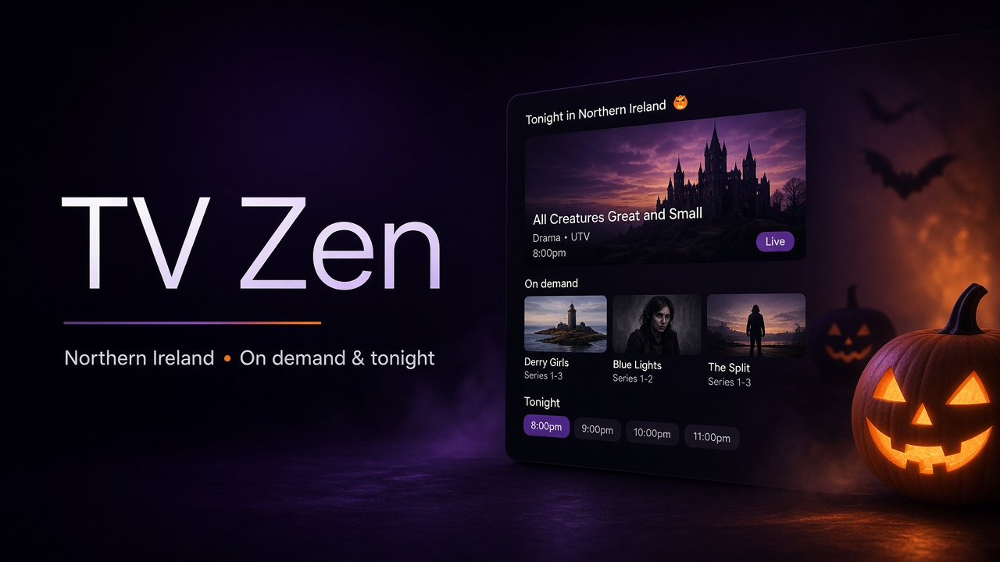

<p align="center">
  
</p>

<h1 align="center">Tonight <sub style="font-size:0.45em;color:#b8a8d4">(TV Zen)</sub></h1>

<p align="center">
  <strong>Private NI TV dashboard</strong> — linear tonight · BBC iPlayer &amp; ITVX on-demand · mystery &amp; soaps
</p>

<p align="center">
  <a href="https://tonight.tgollogly.dev"></a>
  
  <a href="LICENSE"></a>
  <a href="https://tgollogly.github.io/TV-Highligts/"></a>
</p>

<p align="center">
  
  
  
</p>

---

## Live site (GitHub Pages)

| | |
|---|---|
| **URL** | **[https://tgollogly.github.io/TV-Highligts/](https://tgollogly.github.io/TV-Highligts/)** |
| **Deploy** | Push to `main` → [Deploy GitHub Pages](.github/workflows/deploy-github-pages.yml) workflow |
| **Setup** | Repo **Settings → Pages → Build and deployment → Source: GitHub Actions** (one-time) |

Listings use the static `data/tonight.json` bundle on GitHub Pages (refreshed on each deploy). Live `/api/tonight` is available on optional Cloudflare hosting.

Optional private URL: **`tonight.tgollogly.dev`** via [docs/CLOUDFLARE.md](docs/CLOUDFLARE.md) + Cloudflare Access.

---

## Features

| Area | What you get |
|------|----------------|
| **Northern Ireland** | Default region — BBC One NI, UTV, Stormont |
| **On demand** | BBC iPlayer & ITVX hubs + mystery/thriller deep links |
| **Linear tonight** | Rankings, carousel, channel timelines |
| **Watchlist** | Corrie, Emmerdale, Midsomer, Vera, Shetland, Line of Duty, … |
| **Compliance** | Cookie notice, MIT license, LEGAL.md |

---

## Quick start

```bash
npm ci
cp .env.example .env
npm run dev
```

```bash
npm run build && npm run preview
```

### Cloudflare deploy

```bash
npx wrangler login
npm run deploy:cloudflare
```

Pages → project **`ni-tonight`** → custom domain **`tonight.tgollogly.dev`**.

**Auto-deploy:** add GitHub secrets `CLOUDFLARE_API_TOKEN` + `CLOUDFLARE_ACCOUNT_ID` — see [docs/CLOUDFLARE.md](docs/CLOUDFLARE.md). Pushes to `main` then deploy automatically.

---

## Configuration

| Variable | Default |
|----------|---------|
| `VITE_OWNER_NAME` | Thomas Gollogly |
| `VITE_SITE_URL` | https://tonight.tgollogly.dev |
| `CF_PAGES_PROJECT` | ni-tonight |

---

## Legal

| Document | |
|----------|---|
| [LICENSE](LICENSE) | MIT © 2026 **Thomas Gollogly** |
| [LEGAL.md](LEGAL.md) | Personal dashboard; not affiliated with broadcasters |

---

<p align="center">
  <sub>Thomas Gollogly · <a href="https://tgollogly.dev">tgollogly.dev</a></sub>
</p>
